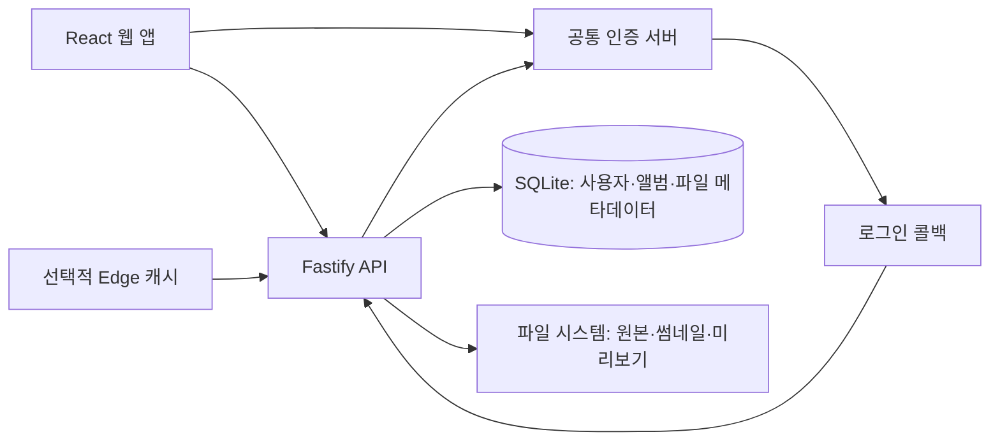

# Home Media Sharing

**가족용 사진·영상·파일 공유 서비스**

흩어진 사진과 파일을 앨범·폴더 단위로 정리하고, 구성원별 접근 권한을 두어 함께 이용하기 위해 개발한 개인 웹서비스입니다. 공통 인증 서버로 로그인하고, 서비스 안에서는 별도의 사용자·세션·앨범 권한을 관리합니다.

[실행과 환경 설정](docs/SETUP.md) · [공통 인증 서버](https://github.com/ho72/unified-auth-server)

## 주요 기능

| 기능 | 구현 내용 | 코드 |
| --- | --- | --- |
| 사진·영상 앨범 | 앨범 생성, 멤버·그룹 관리, 업로드, EXIF·위치 정보, 지도 보기 | [앨범 API](apps/server/src/projects/routes.ts), [앨범 화면](apps/web/src/pages/Project.tsx) |
| 미디어 처리 | 이미지 썸네일, 영상 메타데이터·미리보기, 원본·ZIP 다운로드 | [미디어 API](apps/server/src/media/routes.ts), [처리 모듈](apps/server/src/media/thumbnail.ts) |
| 파일 라이브러리 | 파일 공간·폴더, 업로드, 미리보기, 공유 링크 | [파일 API](apps/server/src/files/routes.ts), [공유 API](apps/server/src/files/shareRoutes.ts) |
| 사용자·권한 | 공통 계정과 서비스 사용자 매핑, 자체 세션, 친구·그룹·앨범 멤버 관리 | [인증](apps/server/src/auth/routes.ts), [그룹](apps/server/src/groups/routes.ts) |
| 활동과 알림 | 앨범 활동 기록과 서비스 내부 알림 | [활동](apps/server/src/activity/service.ts), [알림](apps/server/src/notifications/routes.ts) |
| 선택적 Edge 캐시 | 세션·앨범 접근 권한 확인과 썸네일 캐시를 분리한 Cloudflare Worker | [Worker](apps/edge-worker/src/index.ts) |

## 기술 구성

- **프론트엔드:** React 18, TypeScript, Vite 5, Tailwind CSS, TanStack Query, Leaflet, PDF.js
- **백엔드:** Fastify 4, TypeScript, Prisma 5, SQLite
- **파일 처리:** sharp, exifr, FFmpeg/ffprobe, archiver; 문서 미리보기에는 Poppler·LibreOffice 사용
- **구성·배포:** npm workspaces, Docker Compose, 선택적 Cloudflare Worker

## 구조와 설계



- 로그인 콜백에서 공통 인증 서버의 토큰 서명과 프로필을 확인하고, 공통 사용자 ID를 서비스 사용자에 매핑한 뒤 자체 세션 쿠키를 발급합니다.
- 파일 본문은 파일 시스템에, 사용자·공유 관계·미디어 정보는 SQLite에 저장합니다. 업로드 처리와 DB 메타데이터를 분리한 구조입니다.
- Worker는 접근 권한을 확인하는 캐시와 썸네일 콘텐츠 캐시를 나누어 처리합니다. 로컬 실행에는 Worker 배포가 필요하지 않습니다.

```text
apps/server/       Fastify API, Prisma 스키마·마이그레이션
apps/web/          React 화면과 클라이언트
apps/edge-worker/  선택적 인증 썸네일 캐시
packages/shared/  공유 타입
.env.example       로컬 설정 예시
docker-compose.yml 컨테이너 실행 구성
```

## 실행

Node.js 22와 npm, 공통 인증 서버가 필요합니다. 영상 처리에는 FFmpeg/ffprobe를 준비합니다.

```bash
git clone https://github.com/ho72/home-media-sharing.git
cd home-media-sharing
npm ci
cp .env.example .env
```

`.env`의 `SESSION_SECRET`과 `UNIPASS_JWT_SECRET`을 설정한 다음 아래 명령을 실행합니다. 인증용 서명 키는 공통 인증 서버의 `JWT_SECRET`과 일치해야 합니다. 전체 환경 설정과 관리자 초기화는 [실행 안내](docs/SETUP.md)를 참고하세요.

```bash
npm -w apps/server run db:generate
touch apps/server/prisma/dev.db
npm -w apps/server run db:deploy
npm run dev
```

웹은 `http://localhost:5174`, API 상태 확인은 `http://localhost:3000/api/health`입니다. 위 DB 초기화는 `.env.example`의 `DATABASE_URL=file:./dev.db`를 사용한 새 로컬 설치 기준입니다.

## 확인한 범위

임시 계정·DB를 사용한 연결 검증에서는 공통 토큰으로 로그인 콜백을 처리하고 서비스 세션을 발급하는 흐름, 인증 전 접근 차단, 로그인 후 앨범 목록 조회와 로그아웃을 확인했습니다. 실제 미디어 업로드·변환과 외부 배포는 이번 검증에 포함하지 않았습니다.

2026-10-06 공개 코드 기준으로 Node.js 22.22.2에서 Prisma Client 생성과 서버·웹의 `npm run build`가 통과했습니다. 웹 빌드에는 큰 번들에 대한 경고가 남아 있습니다. 별도의 자동 테스트 명령은 현재 패키지에 없습니다.

실제 사진·영상·사용자 데이터는 이 저장소에 포함하지 않습니다. 공통 인증 서버와 연결할 계정 설정, 외부 지도 키, 선택적 Worker 배포 환경은 각 실행 환경에서 준비해야 합니다.

## 함께 사용하는 서비스

| 저장소 | 역할 |
| --- | --- |
| [unified-auth-server](https://github.com/ho72/unified-auth-server) | 공통 계정·소셜 로그인·토큰 발급 |
| [smart-home-manager](https://github.com/ho72/smart-home-manager) | 스마트홈 기기·자동화 관리 |
| [ai-coding-workspace](https://github.com/ho72/ai-coding-workspace) | 브라우저 기반 AI 개발 워크스페이스 |
